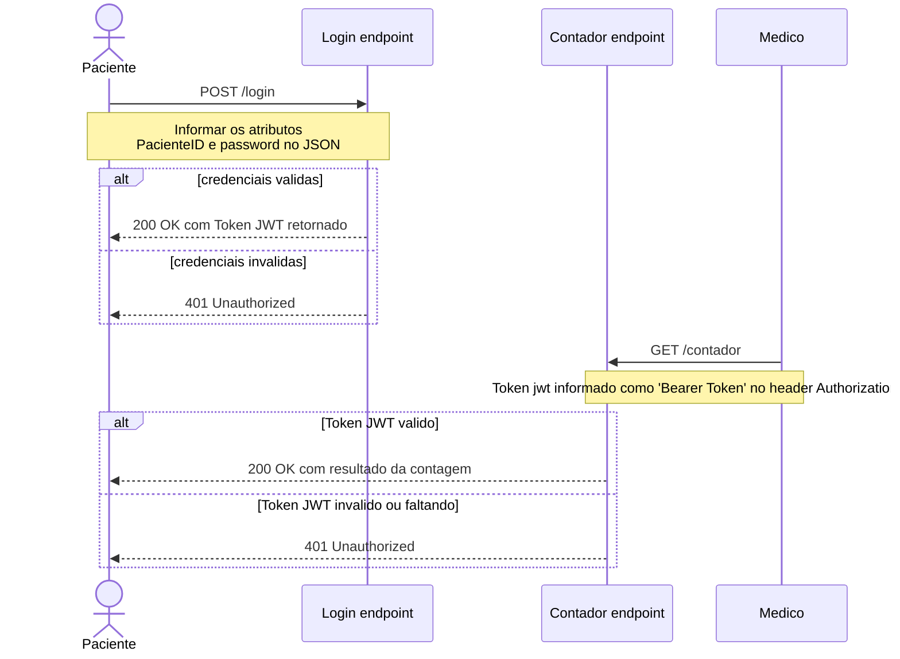

## Fluxo básico

```mermaid
sequenceDiagram
    actor Paciente
    participant Login endpoint
    participant Contador endpoint
    Paciente->>Login endpoint: POST /login
    Note over Paciente,Login endpoint: Informar os atributos<br/>PacienteID e password no JSON
    alt credenciais validas
        Login endpoint-->>Paciente: 200 OK com Token JWT retornado
    else credenciais invalidas
        Login endpoint-->>Paciente: 401 Unauthorized
    end
    Medico->>Contador endpoint: GET /contador
    Note over Medico,Contador endpoint: Token jwt informado como 'Bearer Token' no header Authorization
    alt Token JWT valido
        Contador endpoint-->>Paciente: 200 OK com resultado da contagem
    else Token JWT invalido ou faltando
        Contador endpoint-->>Paciente: 401 Unauthorized
    end
```

