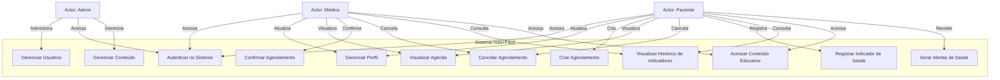

```mermaid
graph TD
    A[Actor: Admin]
    B[Actor: Médico]
    D[Actor: Paciente]
    
    subgraph "Sistema Vida+Fácil"
        UC1[Gerenciar Usuários]
        UC2[Autenticar no Sistema]
        UC3[Gerenciar Perfil]
        UC4[Criar Agendamento]
        UC5[Visualizar Agenda]
        UC6[Cancelar Agendamento]
        UC7[Confirmar Agendamento]
        UC8[Registrar Indicador de Saúde]
        UC9[Visualizar Histórico de Indicadores]
        UC10[Acessar Conteúdo Educativo]
        UC11[Gerenciar Conteúdo]
        UC12[Gerar Alertas de Saúde]
    end
    
    A -->|Administra| UC1
    A -->|Acessa| UC2
    A -->|Gerencia| UC11
    
    B -->|Acessa| UC2
    B -->|Atualiza| UC3
    B -->|Visualiza| UC5
    B -->|Confirma| UC7
    B -->|Cancela| UC6
    B -->|Consulta| UC9
    B -->|Acessa| UC10
    
    D -->|Acessa| UC2
    D -->|Atualiza| UC3
    D -->|Cria| UC4
    D -->|Visualiza| UC5
    D -->|Cancela| UC6
    D -->|Registra| UC8
    D -->|Consulta| UC9
    D -->|Acessa| UC10
    D -->|Recebe| UC12
```
